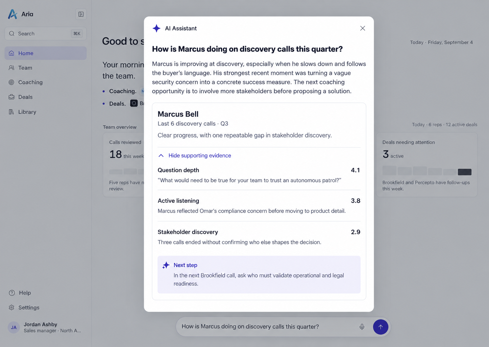
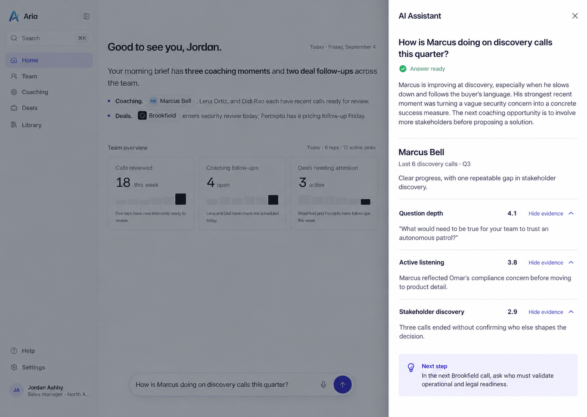
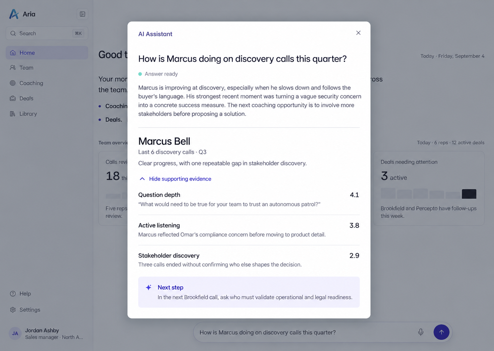

# Aria: three refined coaching-answer directions

10 September 2026 · Design exploration and review · App implementation pending

**Superseded direction:** the user subsequently requested persistent back-and-forth conversation and proposed floating chat and a true third column. Read the [current conversation storyboards](conversation-storyboards-2026-09-10.md) and [supporting research](../research/persistent-conversation-directions-2026-09-10.md). The all-modal, single-answer proposals below remain historical exploration; they are not the active implementation brief.

All three concepts preserve Aria's existing visual language and the complete supplied answer. They differ in where Jordan reads the answer and how evidence is inspected. The [detailed specification](three-refined-options-2026-09-10.md) contains desktop/mobile state storyboards, exact data, motion, accessibility, implementation boundaries, and a requirement-by-requirement README matrix.

## Comparison

| Direction | Best reason to choose it | Main compromise |
|---|---|---|
| 1. Anchored answer | Clear spatial relationship between the submitted question and its answer | Less vertical room above the launcher on short screens |
| 2. Assistant drawer | Predictable, tall reading area; individual skill evidence inspection | More wrapping and more actions to inspect every skill |
| 3. Focused coaching brief | Comfortable central hierarchy from assessment to evidence to next step | A stronger interruption for a short question |

These are the three images in their displayed order in the conversation. All show a completed answer with evidence expanded so the full information hierarchy can be reviewed. The proposed initial card state has evidence collapsed. The images are generated concept illustrations, not screenshots of implemented UI.

## 1. Anchored answer

A spacious window above the launcher replaces the earlier small-popover idea. The outer footprint stays stable while content arrives; one disclosure shows evidence under all three skills. On mobile, it becomes a full-height reading sheet. On short desktops, the same fallback protects reading space.

**Visual review:** all supplied answer content is present and the evidence associations are correct. Two details in this illustration need to follow the written specification in implementation: align the window to the actual launcher centre (the illustration is slightly offset), and include the shared reserved status area with its completed “Answer ready” state. The host screenshot, not the generated background, remains the source for shell geometry.

## 2. Assistant drawer

A full-height drawer gives the assessment a consistent location. Each skill has an independent evidence disclosure, allowing inspection of one gap or comparison across skills. The host remains visible for orientation but is inert; there is no multitasking claim. Mobile uses the full available width.

**Visual review:** all supplied content is present, scores are neutral, and independent evidence controls are visible. The generated background appears compressed to the left. That is an illustration mismatch: the specified implementation overlays the existing shell and covers part of it, without pushing or rebuilding it. Preserve the existing host dimensions and launcher position.

## 3. Focused coaching brief

A central reading surface separates the narrative, scoped coaching card, skill evidence, and next step with typography and spacing. One disclosure reveals all three evidence statements. It uses the same full-height mobile form as the other directions. Stable opening geometry avoids recentering as text arrives.

**Visual review:** supplied content and quote-versus-summary distinctions are preserved. The result provides a clear central hierarchy without extra features. Match the original host and semantic tokens during implementation; generated background geometry, exact pixel sizes, and tint values are illustrative.

## Improvements made through review

- Strengthened the anchored concept into a roomy, stable reading window instead of a growing popover.
- Corrected the side-panel rationale: it can be a modal reading drawer without requiring a simultaneous dashboard task.
- Specified viewport-responsive bounds while keeping geometry stable during stream events.
- Kept the persistent header compact; the submitted question can scroll on narrow, short, or enlarged-text layouts.
- Defined keyboard access to the answer scroll region, in addition to tabbing through controls.
- Specified instant response, close during streaming, rapid reopen, stale-event isolation, and focus restoration.
- Preserved all mock data; rejected invented score scales, source links, thresholds, transcripts, and extra assistant features.

Two independent reviewers checked the written proposals. A separate visual review checked the first two generated images; the primary review checked all three. Copy/data and design-logic review do not establish working accessibility or motion.

## What is covered and what remains

The [README matrix](three-refined-options-2026-09-10.md#cross-check-against-every-assignment-requirement) addresses every required behaviour and distinguishes it from optional enhancement and submission guidance. No required behaviour is intentionally omitted in any direction.

The tall generated canvases do not prove fit at 1280×720, narrow mobile widths, or enlarged text. Actual streaming, scroll, focus, keyboard, screen-reader, reduced-motion, and responsive behaviour still require implementation and verification. The concept-specific visual corrections above are explicit constraints for that next phase, not claims that the images are pixel-accurate builds.

**Recommendation:** the focused coaching brief remains the strongest starting direction for this one assessment. The drawer is a credible alternative for a consistent reading location; the anchored answer is a credible alternative for locality. Mobbin supports the rationale but does not prove one performs better.

Choose one direction before building the final assignment experience; the three options do not imply a production option switcher or three separate implementations.
