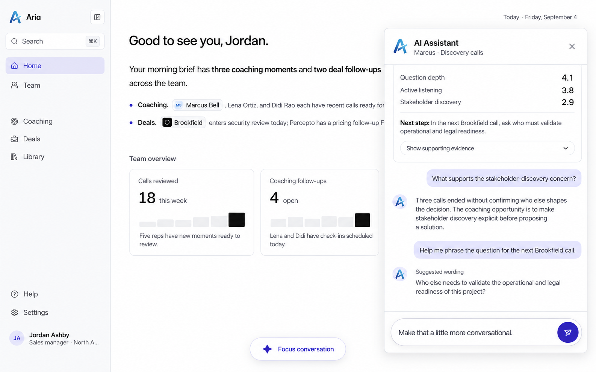
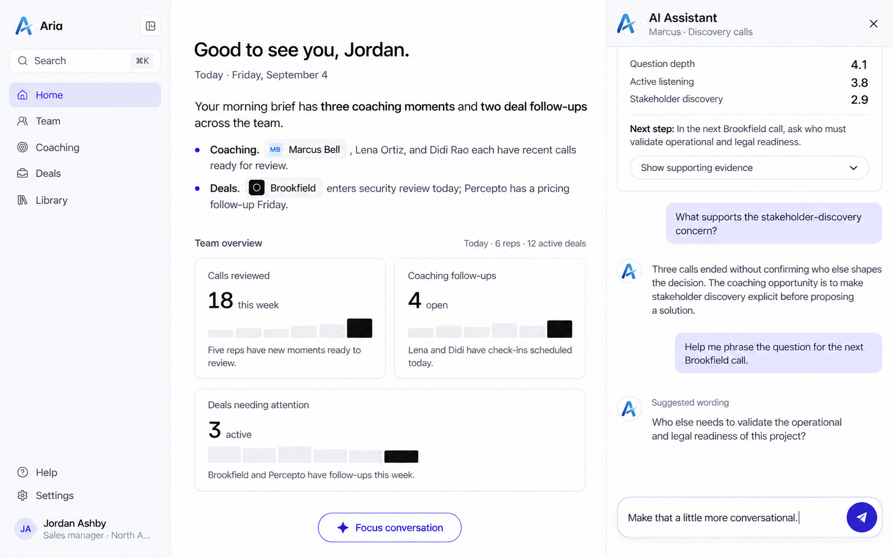
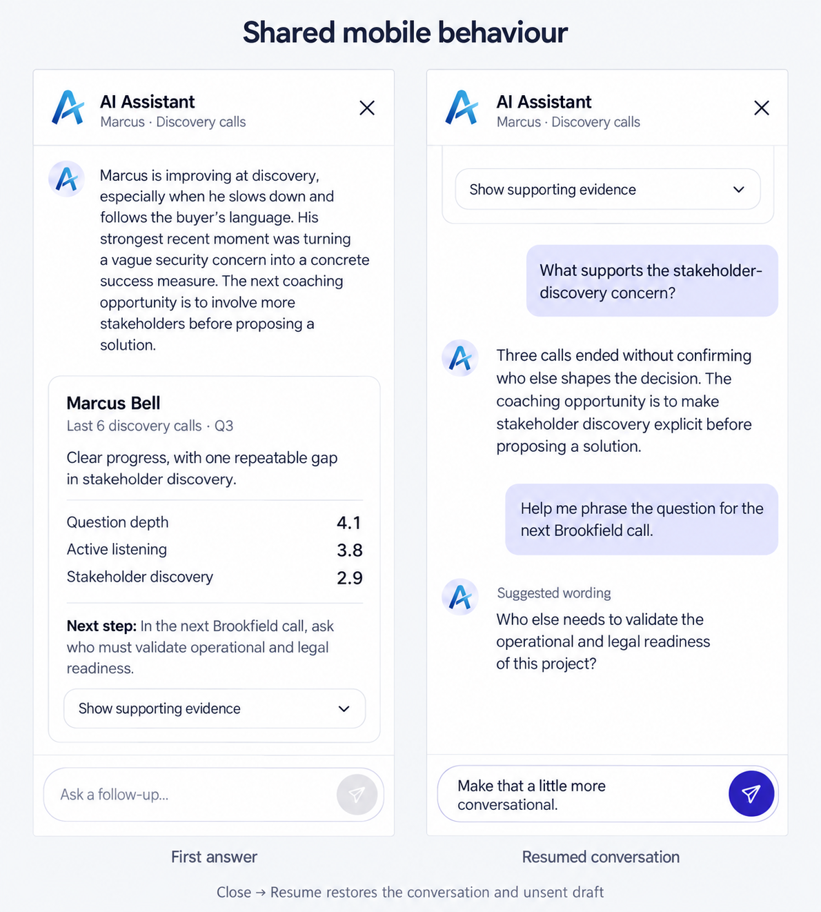

# Conversation storyboards: floating chat and an integrated column

10 September 2026. **Static design comparison. App code is unchanged; no model is connected; layout selection is pending.**
There are two desktop options and one shared mobile adaptation.

## Authority and purpose

- [Assignment README](../../design-engineer-take-home-v3/README.md) defines the required first answer and evaluation.
- [Fixed stream](../../design-engineer-take-home-v3/mock/streamAnswer.ts) and [types](../../design-engineer-take-home-v3/mock/types.ts) define the first answer's data.
- [Persistent-conversation research](../research/persistent-conversation-directions-2026-09-10.md) explains the revised conversational direction and reference limits.
- [Host integration](../../design-engineer-take-home-v3/src/App.tsx) and [styles](../../design-engineer-take-home-v3/src/styles.css) establish the existing entry point and layout.

Help Jordan inspect Marcus's assessment, ask why it matters, and prepare a question for the next call.
Compare containment while holding the conversation, card interaction, and persistence behaviour constant.
The earlier all-modal, one-way proposals are superseded by this continuing-conversation direction.
Follow-ups are an intentional extension; the README neither supplies them nor prohibits them.

## The exact shared three-turn journey

A turn here means one submitted user message and its assistant response.
There are exactly three submitted exchanges. The later unsent draft is not a fourth turn.
Only the first response is supplied by the starter. Responses two and three are authored storyboard examples.
They demonstrate intended conversational behaviour, not output from a connected model.

### Turn 1 — the supplied assessment

**Jordan:** How is Marcus doing on discovery calls this quarter?

**Progress:** Reviewing 6 discovery calls

Append the three supplied text chunks in order. Chunks two and three begin with a space.
The resulting paragraph is exactly:

> Marcus is improving at discovery, especially when he slows down and follows the buyer's language. His strongest recent moment was turning a vague security concern into a concrete success measure. The next coaching opportunity is to involve more stakeholders before proposing a solution.

Then reveal the complete coaching card:

- **Rep:** Marcus Bell
- **Period:** Last 6 discovery calls · Q3
- **Summary:** Clear progress, with one repeatable gap in stakeholder discovery.

| Skill | Score | Supporting evidence |
|---|---:|---|
| Question depth | 4.1 | “What would need to be true for your team to trust an autonomous patrol?” |
| Active listening | 3.8 | Marcus reflected Omar's compliance concern before moving to product detail. |
| Stakeholder discovery | 2.9 | Three calls ended without confirming who else shapes the decision. |

**Next step:** In the next Brookfield call, ask who must validate operational and legal readiness.

The card remains attached to this first assistant message throughout the conversation.
Its summary and next step are accessible before evidence expansion.
One **Show supporting evidence** control reveals all three snippets beneath their corresponding skills.
It becomes **Hide supporting evidence** when expanded; focus remains on the activating control.
Only Question depth is a historical quoted utterance. The other evidence items are summaries.
Do not add a score denominator, thresholds, percentages, rankings, trends, or source links.
The period describes the supplied six-call scope, not complete coverage of every call in the quarter.

### Turn 2 — understand the concern

**Jordan:** What supports the stakeholder-discovery concern?

**Assistant — authored example:**

> Three calls ended without confirming who else shapes the decision. The coaching opportunity is to make stakeholder discovery explicit before proposing a solution.

This response uses the supplied evidence and narrative. It does not identify individual calls or stakeholders.
Do not call the original mock again and present its repeated answer as a new response.

### Turn 3 — prepare the next question

**Jordan:** Help me phrase the question for the next Brookfield call.

**Assistant — authored example, labelled Suggested wording:**

> Who else needs to validate the operational and legal readiness of this project?

This is suggested future wording based on the supplied next step, not a quotation from an earlier call.

### Draft, close, and resume

Jordan types exactly **Make that a little more conversational.** into the composer and does not send it.
Closing hides the conversation; reopening restores the thread, the same evidence state, draft, and reading position.
No response to this draft is shown or implied. Do not add another submitted exchange.

## Shared frame sequence

Use this sequence for both desktop options and the shared mobile adaptation.
A static frame captures a reading position; it does not prove streaming, persistence, or motion.

| Frame | User action / state | Content and visible result | Behaviour to verify later |
|---|---|---|---|
| 01 — Invoked | Submit the prescribed question at the existing entry | User message, assistant header, close, and conversation composer appear | Focus the conversation heading; exactly one initial submission |
| 02 — Status | The mock emits its status | Reviewing 6 discovery calls | Announce once in a separate polite status region |
| 03 — Streaming | Three deltas arrive | The supplied paragraph develops in place | Actual deltas; no duplicate text, replay, or per-chunk announcements |
| 04 — Card | Artifact arrives, then done | Complete initial card with evidence collapsed and next step accessible | Card survives done; announce Answer ready. Coaching card available once while visible |
| 05 — Evidence | Expand, inspect, then collapse before Turn 2 | Three snippets appear with their skills; after collapse the label returns to Show supporting evidence | Keyboard operation, expanded/collapsed state, retained focus |
| 06 — Turn 2 | Submit the concern question | Second user message and the authored explanation append | First card remains; no new mock replay or invented call review |
| 07 — Turn 3 | Submit the Brookfield wording request | Third user message and Suggested wording response append | Exactly three completed exchanges; text clearly identified as a draft question |
| 08 — Unsent draft | Type the specified draft | Draft remains in the composer beneath the latest response | Draft is editable and has not entered the transcript |
| 09 — Closed | Activate close or Escape | Host is usable; bottom-centre entry offers Resume conversation | Thread survives; focus returns to the updated entry target |
| 10 — Resumed | Activate Resume conversation | Same thread, draft, evidence state, and logical reading position | No repeated first question, reset, duplicate card, or automatic draft submission |

For default mock timing, status arrives around 360 ms, text around 820/1,280/1,740 ms, and card around 2,260 ms.
Done follows the artifact immediately. These times exclude rendering and scheduling overhead.
At speed: 0, intermediate states may never paint; the complete answer must still be correct.

## Entry point, persistence, and input

Keep the original bottom-centre location and visual relationship throughout the journey.
Initially, it is the supplied question input and submit action.
While the conversation is open, it becomes **Focus conversation**, moving focus to the one active composer.
When the conversation is hidden, it becomes **Resume conversation**, reopening the existing thread and draft.
Closing restores focus to that updated entry target; update the host focus reference accordingly in eventual implementation.
Do not leave the original question in a second send field or silently submit it again when resuming.
Resuming places focus in the composer without sending its draft; preserve the draft selection when practical.
Only explicit submit creates a new user message. Preserve multiline and text-composition input.
On first open, focus the conversation heading programmatically. Make the labelled transcript scroller keyboard reachable so narrative and evidence can be read before moving to the composer.
Allow drafting while a response is arriving, but use one active send at a time and prevent duplicate submissions.
Persistence here means the current app session. Reload persistence, history management, and multiple chats are not promised.
Conversation state and active response ownership must survive the dismissible surface's unmounting.
For this proposal, closing hides rather than cancels: an active response may finish in session while hidden.
Suppress hidden progress announcements and never reopen the surface automatically.
If a future model request fails or is explicitly cancelled, do not mark an incomplete answer complete or erase the thread.

## A. Persistent floating chat

The desktop hero represents the latest three-turn reading position with the unsent draft.
Earlier narrative is intentionally above the viewport; it remains in the transcript and is specified in full above.
Do not squeeze every message and expanded card into one frame by reducing text to unreadable sizes.

- For the 1440×900 desktop comparison, use a 460 px-wide, 760 px-high chat with 24 px right and bottom margins; both desktop heroes use the same conversation width.
- Keep the host layout in place and usable; the chat overlays part of it without a blocking scrim.
- Use a compact header, one transcript scroller, and a composer within the window's bottom area.
- Keep ordinary body text near 15–16 CSS px. Wrap long skill labels deliberately and keep scores legible.
- Use neutral surfaces, Inter, and existing Aria typography/colour conventions.
- Cap height to the current available viewport. Recalculate for resize, zoom, browser chrome, and keyboard changes.
- Hold the window's geometry stable during token arrival; content scrolls inside rather than enlarging the window.
- Desktop is nonmodal: no inert host, modal focus trap, or click-outside dismissal.
- Closing retains state. A separate minimize, resize, or dock control is not necessary for this comparison.

**Benefit:** the smallest host integration and a familiar continuing-message window.
**Tradeoff:** it obscures some host content and limits how much earlier evidence can be visible at once.

## B. Integrated conversational column

This hero shows the same latest conversation state, not a different answer or a shorter card.
The first narrative sits above the current transcript viewport; earlier messages remain scrollable.

- Use navigation → main content → conversation as three genuine layout columns on a sufficiently wide desktop.
- Allocate space to the assistant; decrease the main area's width instead of covering it with an overlay.
- Keep all three areas usable and omit scrims, inert background, and modal focus trapping.
- Give the conversation a compact header, its own transcript scrolling, and a reachable composer.
- At the same 1440×900 viewport, allocate 240 px navigation + 740 px main area + 460 px conversation; use the same readable type as the floating option.
- Adapt the centre container: greeting/date can wrap and statistics can move to fewer columns.
- Opening and closing intentionally reallocate width once. Later token arrival must not change the column width.
- Closing restores the centre area while retaining the thread. Reopening restores the same conversation.
- Compact navigation is an intermediate-width possibility; do not silently overwrite the user's navigation preference.

In a separate sizing exploration, distinct from the 460 px-wide heroes, a 240 px sidebar and illustrative 420 px assistant leave centre content after existing padding of about 668 px at 1440, 518 px at 1280, and 282 px at 1024.
The compact sidebar is 72 px. Existing mobile CSS switches at 760 px and cannot alone handle a compressed centre container.
These are CSS calculations, not browser validation. Choose breakpoints after testing real content and font enlargement.

**Benefit:** a durable conversational area alongside the work.
**Tradeoff:** more integration and responsive-layout work than the floating window.

## Shared mobile adaptation

This is one shared mobile board, showing first-answer inspection and the resumed three-turn conversation.
It is not a third option. The two desktop arrangements converge to the same full-height mobile view.
Show readable portions of the transcript at distinct scroll positions; do not pretend the entire thread fits at once.

- Use a full-width conversation view with a concise header, close control, transcript, and composer.
- The full-screen mobile conversation uses modal semantics: the host is inert and focus stays within the conversation while open.
- Keep only essential header controls fixed. A long question belongs in the transcript, not an oversized fixed header.
- Account for safe areas and the software keyboard; the composer must not cover the latest readable content.
- Preserve state and logical reading position when crossing a layout breakpoint or changing orientation.
- If the desktop-to-mobile transition finds focus in the now-covered host, move it to the conversation heading. Otherwise retain the focused conversation control.
- The first-answer state retains all initial content in the scrollable transcript; evidence remains associated with skills.
- The resumed state retains the exact unsent draft and shows the latest response without resubmitting anything.
- On close, restore focus to Resume conversation. Do not unnecessarily open a keyboard merely to show the closed host.

## README acceptance and evidence boundary

**Visual review:** the final assets preserve the visible mock data, both authored follow-ups, the sole unsent draft, and collapsed evidence state. Independent reviewers inspected both desktop images and the mobile board; no material content or layout discrepancies remain. The floating illustration was revised to remove render artifacts; the column illustration was revised to remove invented message timestamps and align shared controls.

Generated image dimensions are 1586×992 for each desktop and 1190×1322 for the mobile board. The 1440×900 desktop and 390×844 mobile values above are intended CSS viewport targets, not measured browser results. Match the original host's actual tokens and geometry during implementation; generated backgrounds are illustrative. The mobile board shows the software keyboard hidden.

| Requirement | Defined in both proposals | What remains unverified |
|---|---|---|
| Existing invocation, dismissal, Escape, focus return | Entry lifecycle and updated focus target | Real keyboard walkthrough at every response stage |
| Status, three chunks, complete card, done | Unchanged first mock and attached first-message card | Actual stream integration, ordering, and speed: 0 |
| Coherent reveal | Stable geometry and transcript reading position | Browser recording without distracting jumps |
| Meaningful card interaction | Global evidence disclosure with explicit associations | Pointer/keyboard operation and accessibility state |
| Desktop and narrow mobile | Two desktop arrangements; one full-height mobile view | Real widths, short heights, zoom, keyboard, and reflow |
| Keyboard and assistive technology | Nonmodal desktop; deliberate mobile semantics; per-response status | Screen-reader tests and no repeated chunk announcements |
| Purposeful motion and reduced motion | Restrained entrance; immediate layout/state changes when reduced | No invisible content, focus loss, or animation dependency |
| Typed, readable, extendable code | Separate conversation, first-stream, surface, and card responsibilities proposed | Implementation, source review, typecheck, and build |
| No drop-in assistant kit; source and natural history | Custom answer experience and ordinary commits planned | Final dependencies, readable source, and submission |

Follow new text only while the reader is already at the bottom; otherwise retain position and indicate a new reply.
Incoming answers never steal focus from the composer or host. Suppress announcements while hidden.
Use a separate polite region for the initial reviewing status, Answer ready. Coaching card available, and later Reply ready announcements. Keep streamed narrative, messages, and card content outside live regions.
Start with a restrained 180–220 ms surface entrance and 120–160 ms card reveal; do not animate individual tokens or delay data for choreography. Reduced motion uses immediate geometry and opacity changes with the same hierarchy and status cues. Tune these starting values in the browser.
Test close before status, mid-text, after card, and after the draft; then resume without resetting or mixing responses.
Test viewport changes, evidence expansion, narrow/short screens, enlarged text, reduced motion, and instant completion.

## Future response route and next decision

Preserve the prescribed first answer on the unchanged mock. Use a separate grounded model route for general typed follow-ups.
The starter ignores prompt text and provides no follow-up engine; replaying it is not conversational intelligence.
A real model would receive only the supplied assessment and conversation context; unavailable transcripts remain unavailable.
Server-side credentials and request/error/cancellation behaviour need an explicit implementation decision.
Authored fixtures can demonstrate this storyboard reliably, but must remain identified as fixtures rather than silently replacing general conversation.
Static concept images prove neither live AI, persistence, streaming, responsiveness, motion quality, nor accessibility.

The integrated column remains the recommendation for a continuing workspace assistant; floating chat is the lighter alternative.
The user has not selected a layout. Choose using this shared journey before implementing one direction.
A dock/float switch is a possible later extension, not a requirement to build both production modes.
The README's live preview, concise DECISIONS.md, and short desktop/mobile recording remain submission guidance.
Prepare to explain design priorities, AI use and overrides, and make a small change in the debrief.
