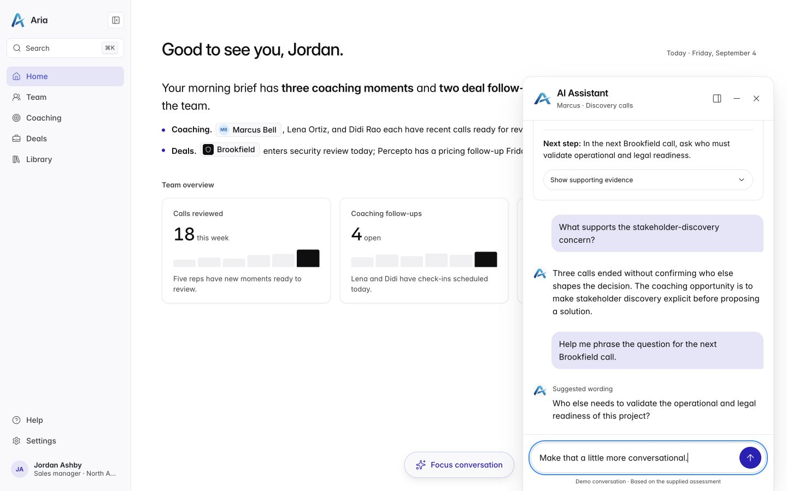
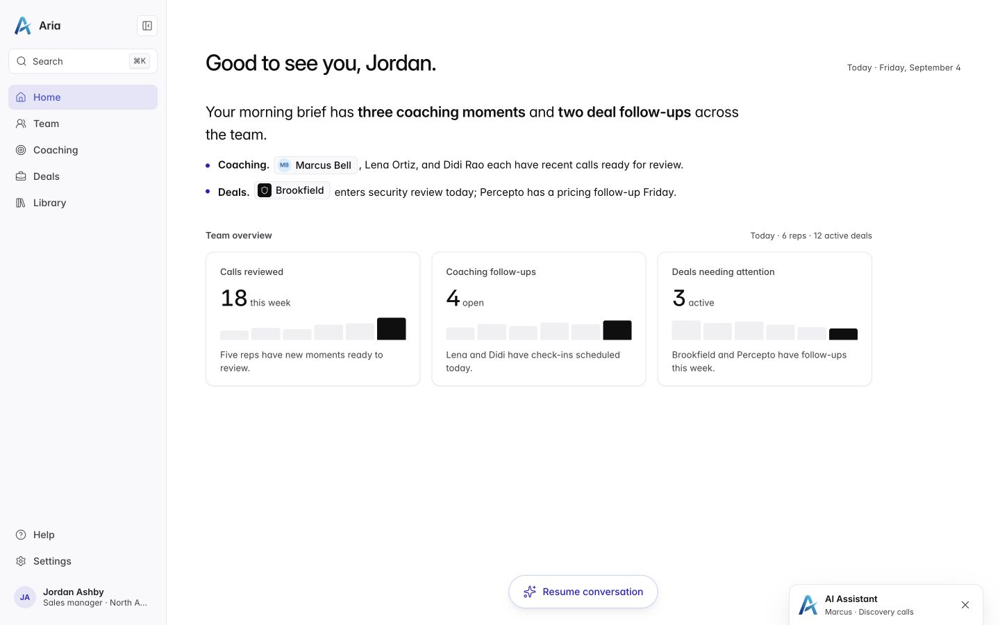
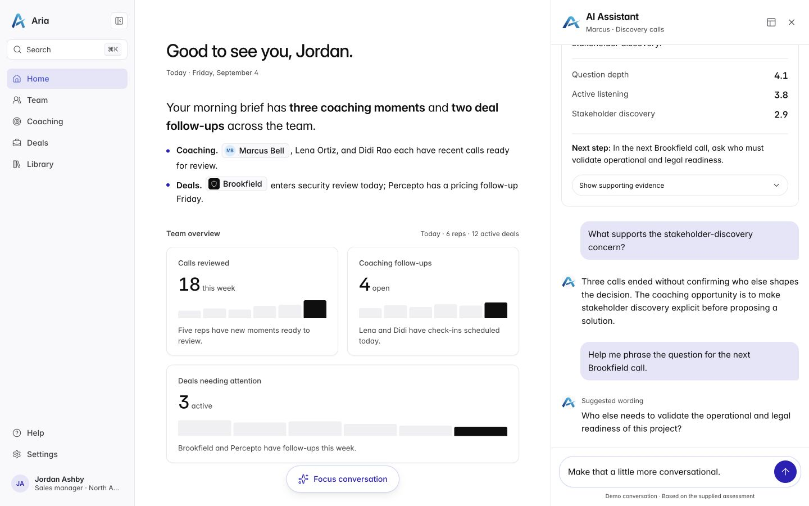
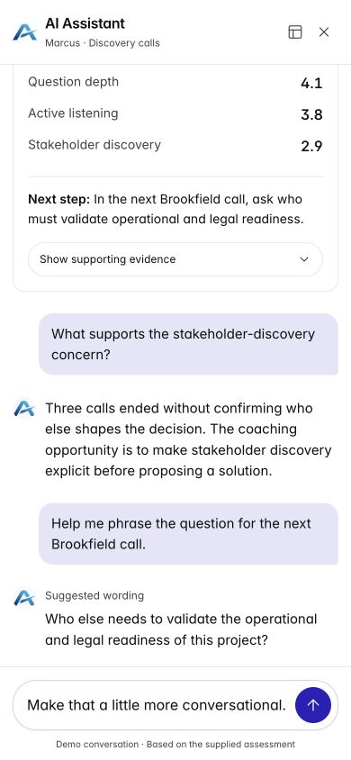
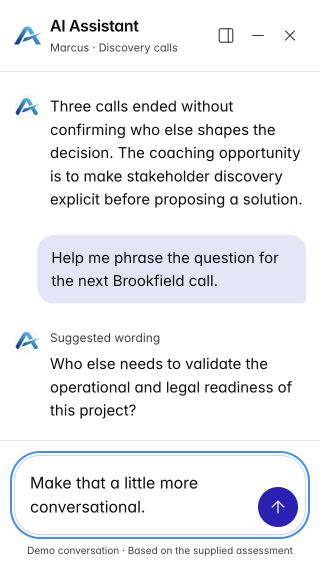

# Both conversational layouts are implemented

> Historical implementation. The current version separates `/floating` and `/column` and removes the layout switch. See [current implementation and QA](separate-pages/README.md).

10 September 2026. Local assignment prototype; follow-ups are explicitly labelled guided demo responses, with no connected model or external calls.

The [original assignment README](../../design-engineer-take-home-v3/README.md) and fixed mock remain unchanged. [DECISIONS.md](../../design-engineer-take-home-v3/DECISIONS.md) explains prioritisation and AI use. [Design QA](../../design-engineer-take-home-v3/design-qa.md) records the checks and their limits.

## Try the two layouts

Run the app using the repository README, then submit the supplied initial question. It opens floating chat by default. Use the layout icon in the chat header to switch to the integrated column; there is no upfront layout selector. The first question is deliberately preset to the assignment's fixed assessment. Follow-up text is editable inside the conversation.

- Floating chat stays attached to the viewport's bottom edge. **Minimize** leaves a compact restore bar; **Close** removes the bar and panel. Both retain the thread, evidence state, draft, and reading position in this app session.
- The integrated column allocates real space beside navigation and main content. The host reflows; it is not covered by an overlay.
- The header's layout icon switches between the two arrangements without starting another conversation.
- At widths of 760 CSS pixels or less, both become a full-height conversation with minimize and close controls. The layout switch is hidden because the two arrangements look the same. At 761–1,099 pixels, the switch is labelled **Expand conversation** because the column takes the full-height form there; floating chat stays available on smaller desktops.
- The host entry is hidden while chat is open or minimized. Closing reveals **Resume conversation**, so no duplicate button sits behind the panel.
- **Escape** closes and focuses **Resume conversation**. Desktop host controls remain usable; the full-screen mobile view contains keyboard focus.

The initial layout can also be selected with `?layout=column`; the default is floating. No page reload persistence or multi-thread history is promised.

## Conversation walkthrough

1. Submit the supplied Marcus question and watch the status, three narrative chunks, and coaching card arrive.
2. Open **Show supporting evidence**, inspect all three skill associations, then collapse it.
3. Ask: **What supports the stakeholder-discovery concern?**
4. Ask: **Help me phrase the question for the next Brookfield call.**
5. Type **Make that a little more conversational.** without sending. Minimize, restore, close, and resume; the draft stays intact.
6. Send that draft to try the context-dependent wording revision. Unknown topics receive an honest explanation of the guided demo's scope.

The local provider supports these assessment topics; it is not general AI. It never replays the original mock to answer a follow-up and does not invent transcript links, score scales, or additional records.

## Rendered implementation

The [follow-up review](review-2026-09-10/README.md) records the simpler entry, responsive header controls, and clearer demo note with current screenshots. The captures below document the preceding implementation pass.

The newer [bottom-attached concept](assets/conversation-bottom-attached.png) illustrates the requested position and minimize control. Its generated host date drifted; implementation intentionally retains the supplied September 4 fixture, original font, logo, sidebar geometry, and semantic colour tokens.

## Verification boundary

Eight automated tests pass, including the unchanged stream tests and conversation lifecycle tests. TypeScript and production build pass. Browser checks cover both placements, first-answer continuation while hidden, evidence disclosure, three exchanges, minimize/close/resume, draft retention, keyboard focus, and 390- and 320-pixel mobile views.

Actual assistive-technology speech, physical mobile software keyboards, and OS reduced-motion preference switching were not exercised. The implementation includes a separate polite status region, modal focus containment on mobile, visual-viewport sizing, and a reduced-motion stylesheet. See the QA report for details and the corrected narrow-screen draft issue.

Implementation references: [WAI-ARIA modal-dialog pattern](https://www.w3.org/WAI/ARIA/apg/patterns/dialog-modal/) for mobile focus behaviour, and [MDN VisualViewport](https://developer.mozilla.org/en-US/docs/Web/API/VisualViewport) for keyboard-sensitive viewport sizing.
