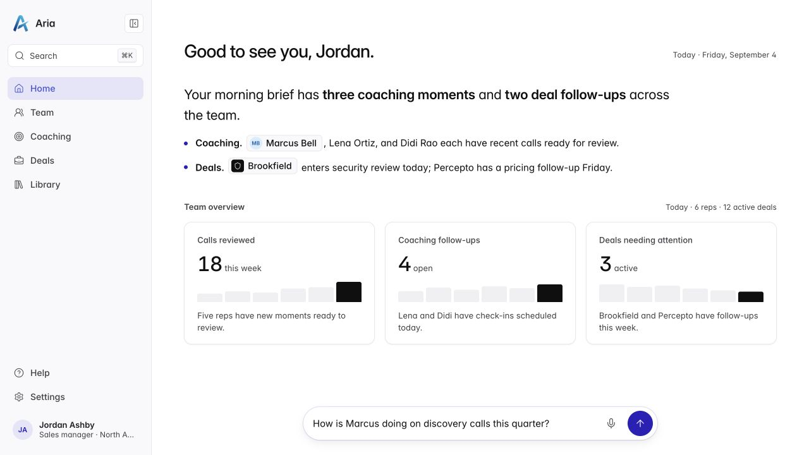
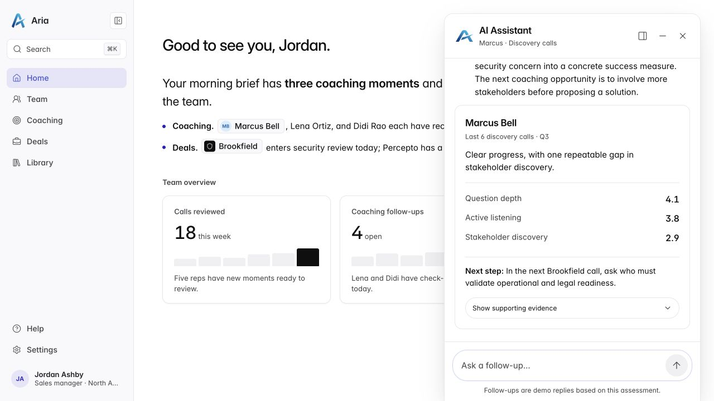
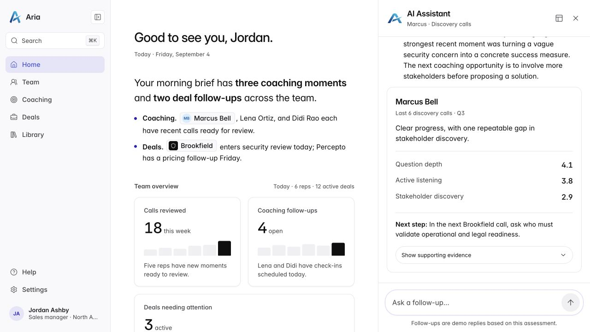
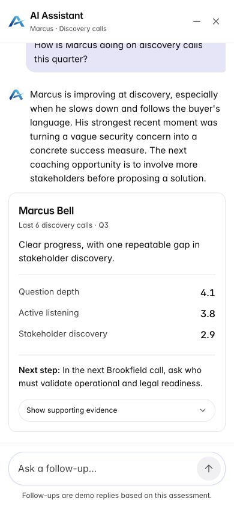
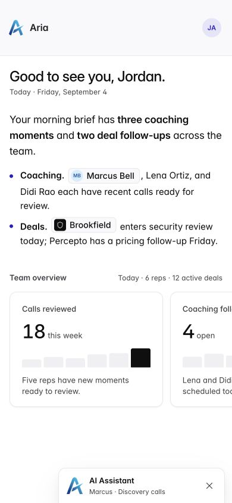
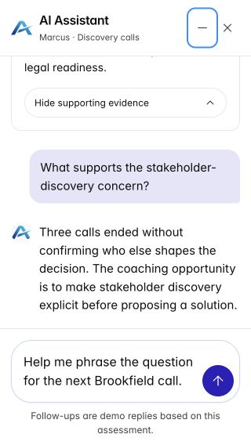

# Conversation review and refinement

10 September 2026. Reviewed the existing local prototype against the original assignment README and the requested simpler entry. The initial page now has one clear action: ask the prescribed question. Floating chat opens by default; the chat header switches presentation.

## 1. Ask the first question — improved

The initial Floating chat / Third column selector made Jordan choose a presentation before seeing an answer. Removed it, keeping the supplied bottom entry and question intact. The host font, spacing, logo, colours, and content remain unchanged.

## 2. Read and continue the floating conversation — verified

The fixed status, three text chunks, coaching card, and all three supporting evidence snippets are preserved. A follow-up about stakeholder discovery received the scoped demo response. The 460-pixel window stays attached to the bottom.

Review found a redundant Focus conversation button partially covered by the panel. The entry is now hidden while the chat is open or minimized, returning as Resume conversation after close. The demo note is explicit and increased from 10 to 12 pixels.

## 3. Switch to the integrated column — verified

The desktop header icon switches the same conversation into the workspace grid. Messages, evidence state, and draft remain intact. No duplicate host button sits over the content.

At 761–1,099 pixels, the action is labelled Expand conversation and uses an expansion icon: this width opens a full-screen conversation. At 1,100 pixels and above, the label accurately says Use integrated third column.

## 4. Work and resume on mobile — improved and verified

On phones, both presentations already converge to full screen. The previous layout switch changed the available controls without changing the layout. It is now hidden at 760 pixels and below; both modes have minimize and close. The desktop layout choice remains in session state.

Minimizing exposes the restore bar and focuses it. Restoring focuses the composer and retains an unsent draft. Escape closes the surface and focuses Resume conversation. When resizing removes a focused layout switch, focus moves to the conversation heading; Tab then reaches Minimize.

At 320 × 568, the draft wrapped to two lines with matching 64-pixel client and scroll heights. The composer, send action, and demo notice remain readable.

## Verification and limits

- All 8 automated tests pass, including the unchanged mock stream tests. The production build includes TypeScript checking and passes.
- All four before/after pairs were captured and inspected in this review session. Desktop pairs are 1280 × 720 and mobile pairs are 390 × 844 at 1:1 screenshot density. Intended changes are recorded above.
- The current browser run verifies entry, both desktop placements, responsive labels, evidence disclosure, follow-up submission, draft retention, minimize/restore, Escape, and focus after a removed control.
- Error/warning logs after the fresh reload at 07:47:45 UTC were empty. One older development hot-refresh warning arose when an effect dependency list changed; it did not recur after the reload.
- The assignment README and mock payload were re-read and remain unchanged. Follow-ups remain a labelled local demo, with no live model or additional dataset.
- Screen-reader speech, a physical mobile keyboard, OS reduced-motion switching, and a formal accessibility audit were not tested in this pass. Existing status announcements and reduced-motion rules were checked in source, not certified by the screenshots.

No further structural change is needed for this refinement. A short usability walkthrough with a person is the next useful validation: confirm that the header layout control is discoverable and that they can explain the assessment and next step after reading the streamed answer.

See [implementation notes](../implementation-2026-09-10.md) and the [design QA report](../../../design-engineer-take-home-v3/design-qa.md).
