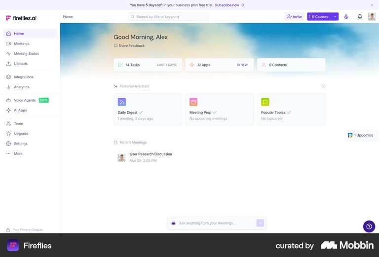
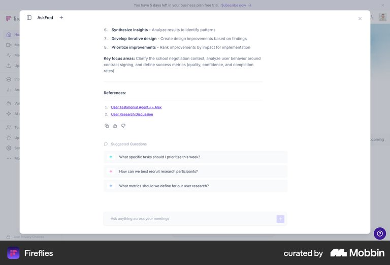
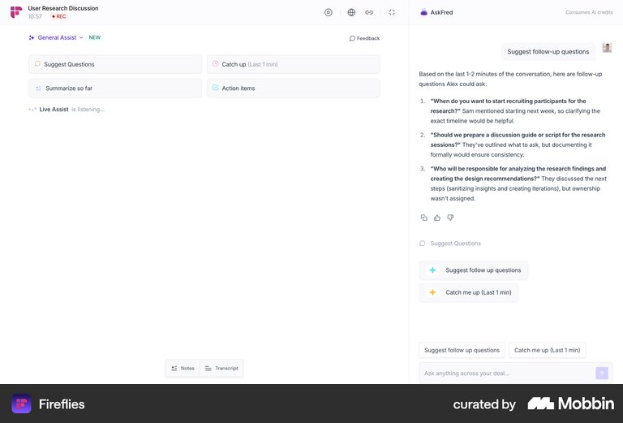
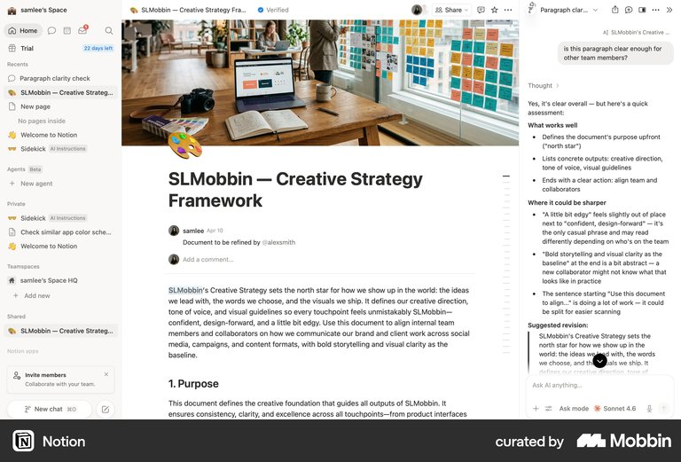
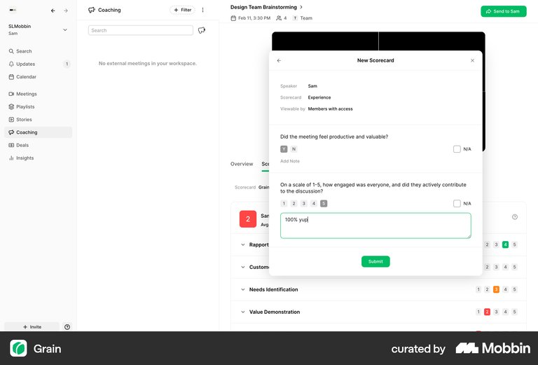

# Mobbin reference research for the Aria AI Assistant

Research date: 10 September 2026. Status: research and design recommendations; no option has been approved for implementation.

Current direction: [persistent conversation research](persistent-conversation-directions-2026-09-10.md) follows the user's request for back-and-forth AI chat in a floating window or true third column. It supersedes the focused-brief preference and no-follow-up recommendation below. Earlier source observations remain research evidence, not restrictions on the new direction.

Follow-up: [the refined three-option review](../design/three-refined-options-2026-09-10.md) develops all three directions. It corrects one overly restrictive interpretation below: a simultaneous host task supports a multitasking rationale, but a modal side drawer can also be justified as a predictable tall reading area. The source observations remain unchanged; the later design review supersedes the option-selection recommendation in this research note.

## Decision supported by this research

The strongest reference for our particular task is Fireflies AskFred's focused answer overlay. Its global question entry is at the bottom of the workspace, and the sampled flow shows a large central answer surface with a separate References section. Fireflies also uses a side panel in a live-notes context. The useful distinction is the task being performed: reviewing an answer across meetings versus asking for assistance alongside an ongoing meeting.

Our recommendation is to explore Option 3, the focused coaching brief, using the existing Aria entry point and visual vocabulary. Keep Option 1, the anchored answer, as an alternative to check against available reading space. Option 2 remains appropriate if we can explain why the underlying workspace needs to remain usable during this particular answer.

This is design inference from observed examples and the assignment. It is not usability evidence that a centred dialog performs better.

## Scope and method

- Target: Jordan's fixed question about Marcus's discovery-call performance, followed by the supplied streamed assessment, three-skill coaching card, supporting evidence, and next step.
- Authority: the [assignment README](../../design-engineer-take-home-v3/README.md) and [mock payload](../../design-engineer-take-home-v3/mock/streamAnswer.ts).
- Source: Mobbin MCP screen and flow search. Research covered desktop answer surfaces, narrative and evidence hierarchy, coaching/meeting summaries, narrow mobile reading, and small utility actions.
- Fourteen focused searches were performed: eight for desktop surfaces/flows/scorecards, three for supporting evidence, and three for mobile patterns.
- Forty-two unique images were visually inspected across the research team: 34 web images and eight iOS images. Counts include the inline previews supplied by flow searches and exclude duplicate screen IDs.
- Five flow records were returned. Only their emitted previews were inspected: this is not a claim that every screen or transition in each flow was reviewed. One Fireflies voice-agent flow was rejected as unrelated.
- Native iOS examples inform mobile hierarchy; they do not establish responsive-web behaviour.
- Snapshot capture dates and the products' current live behaviour were not verified. The date above is our retrieval/review date.
- No user interviews, task-completion measurements, keyboard tests, screen-reader tests, or motion measurements were conducted on these reference products.

The same generic research intent was used for every search. Assignment source text, personal context, and private project contents were not sent as search queries.

## 1. Fireflies: placement changes with the job

### Global assistant

Sources: [Chatting with AI flow](https://mobbin.com/flows/65275e70-7b71-4bc8-9d23-83586b90dc82), [completed answer screen](https://mobbin.com/screens/0e277c22-7dac-4085-aa59-cd24cd3dbc52).

Observed previews: positions 1, 4, 7, and 10 of the 10-screen flow. The home view contains a bottom-centre question entry. Later views show a large central AskFred overlay above a dimmed workspace, followed by an answer with a References section, secondary utility controls, suggested questions, and a close control at the upper right. The previews do not show the exact opening animation or establish that submission directly triggers a particular transition.

Apply: retain the familiar point of invocation, give the result its own reading area, and distinguish the assessment from supporting evidence. Keep the visible close control easy to find.

Do not import: meeting filters, additional prompts, a research workspace, conversation history, or references to records absent from our mock. Our assistant starts after the question is submitted; we do not need a second prompt-entry stage inside the surface.

### Assistant beside live notes

Source: [Chatting with AI — live notes flow](https://mobbin.com/flows/31866c11-6fcc-4585-977b-7ec6b0d0531e).

All three returned previews were inspected. Notes and general-assist controls occupy the left area; the right AskFred panel contains a question, numbered suggested follow-up questions, and a subsequent short catch-up answer. This demonstrates a side-by-side visual relationship to an ongoing meeting.

Apply: use a side panel when the primary task continues beside the assistant. For Aria, simultaneous host interaction is an assumption that needs a reason; the README does not require it.

Limit: screenshots do not establish whether the panel is keyboard-modal, how focus moves, or whether any region is sticky.

## 2. Notion and Semrush: keep the inspected material beside the assessment when it matters

Sources: [Notion paragraph assessment](https://mobbin.com/screens/7e25606f-869e-4867-8400-cfac83d7e1b1), [Semrush AI writing panel](https://mobbin.com/screens/d5fa9c73-0fbd-4b6e-9d7a-b7fa36e54a2c).

Observed: Notion displays the document alongside an AI answer organised into what works, where it could be sharper, and a suggested revision. Semrush displays an article beside AI-generated title and paragraph suggestions. These are tangible examples of two visible areas supporting review of the same material.

Apply: separate overall assessment, strengths, coaching opportunity, and next action through hierarchy. The conceptual association is useful even if our answer lives in a focused dialog.

Do not import: document editing, revision insertion, generation controls, or a second source pane simply because other products expose one.

Related references: [Fabric note with AI summary](https://mobbin.com/screens/c6048777-510b-4293-8bc7-7ca53f75a515) and [Dropbox Dash answer alongside a generated document](https://mobbin.com/screens/f7b146fb-ea9a-4596-a37a-3f72b340ea1e). The latter places the conversation to the left of the document, illustrating that adjacency is the useful relationship, rather than a mandatory right-side placement.

## 3. Sana, ChatGPT, and Copilot: keep evidence associated with the claim

### Sana

Source: [structured answer with row-level references](https://mobbin.com/screens/3ea1b2d6-e04e-4f6f-8d89-a75d0a4296cd).

Observed: an Action items table separates Task, Owner, Deadline, and Notes. Small reference pills are attached to particular notes; a Sources control appears after the answer.

Apply: when evidence is revealed, show each explanation beside or directly beneath its skill. A single control may reveal all three explanations, but their association with Question depth, Active listening, and Stakeholder discovery must remain explicit.

Do not import: a task-management table, owners, deadlines, or citation entities that the assignment does not provide. The source control is not shown opened, so its behaviour remains unknown.

### ChatGPT

Source: [answer with separate Activity and Sources area](https://mobbin.com/screens/73833b79-1dd5-4354-8fc4-a2e99c33a75e).

Observed: the central answer remains readable while a right pane exposes Activity and 23 Sources. A compact Sources affordance also appears below the answer.

Apply: keep the answer primary and make its supporting material discoverable as secondary information.

Do not import: a second evidence pane for only three short statements, a research timeline, a fabricated source count, or simulated reasoning.

### Microsoft Copilot

Source: [conclusion with compact source references](https://mobbin.com/screens/4231bf7c-30e1-4bef-9992-05c7aa2db22b).

Observed: numbered references appear in the conclusion; domain chips and a further-sources chip sit below the answer.

Apply: a restrained evidence affordance can remain easy to find without competing with the main takeaway.

Do not import: domain badges, URLs, source counts, and citation numbers. Our evidence consists of three supplied strings.

## 4. Grain and Otter: distinguish assessment, next action, and editing

Sources: [Grain meeting summary](https://mobbin.com/screens/afa810d0-920e-4189-87e3-a394a7db69fb), [Grain manual scorecard editor](https://mobbin.com/screens/5ba5ca46-2c2d-4823-b771-0a75e817589a), [Otter summary with copy confirmation](https://mobbin.com/screens/1297266c-a045-47f3-a17f-1e18e566352b).

Observed in the Grain summary: Purpose, Chapters, Outcomes, and Action Items are distinct. Recording and transcript-related controls are adjacent. The Scorecard tab in this particular screen is unopened, so it alone provides no evidence about scorecard content.

A separate targeted search returned an actual Grain New Scorecard editor. It contains a speaker, rating questions, an explicitly labelled 1–5 question, a note field, and submission. Skill rows with numeric ratings are partly visible behind the editor.

Apply: keep the skill label, score, and explanation associated; make the suggested next step a distinct part of the result. The scorecard editor also highlights a boundary: presenting an assessment and editing a rating are different tasks.

Do not import: score editing, coloured performance thresholds, a 1–5 denominator, transcript playback, or timecodes. Grain's explicit scale is not evidence of the scale used by our mock.

Observed in Otter: Overview and Action Items are distinct; a copy-summary control and a Copied to clipboard confirmation are visible.

Optional inference: Copy next step is a small, supportable enhancement if the required journey is complete. It should copy exactly the supplied text and confirm actual success. The screenshot does not establish the reference product's announcement behaviour or confirmation duration.

## 5. Perplexity and ChatGPT on iOS: give reading sufficient vertical space

Sources: [Perplexity long-form answer](https://mobbin.com/screens/d7fd830d-30e7-4a70-ae5b-ae8c9709db2e), [Perplexity answer and source cards](https://mobbin.com/screens/6bddd5f8-1009-43e5-90ba-3cb4a053c9ed), [Perplexity structured result](https://mobbin.com/screens/67ff18d6-4a29-418d-9f55-b51010e0b462), [ChatGPT Sources flow](https://mobbin.com/flows/e23ae18d-4aa1-4f4e-a8fd-47f1c5d32107).

Observed: Perplexity gives the answer most of the available screen height and uses question/result titles, section headings, and structured lists. Some examples have source cards and numbered references. ChatGPT's two inspected Sources previews show a sheet above a report, with a visible close control, source titles/domains/snippets, and Activity/Sources choices.

Apply: use a generous single-column mobile answer with explicit dismissal. Keep the coaching card in the same reading area as the narrative. Supporting evidence may be secondary while remaining easy to discover.

Do not import: native platform chrome, source carousels, research modes, images, multiple nested sheets, or a persistent follow-up composer. The referenced ChatGPT sheet accommodates 23 citations; our three short explanations are better candidates for inline disclosure.

These are native iOS precedents. Responsive CSS, mobile browser behaviour, keyboard appearance, reflow, and accessibility remain implementation and verification work for our web app.

## How the evidence changes the three options

| Direction | Evidence strength in this search | Recommendation |
|---|---|---|
| 1. Anchored answer above the entry point | Strong precedent for retaining a recognisable entry point, but no close match for our complete answer remaining in a compact bottom-anchored surface was found in the reviewed sample. Several hits were prompt-entry or unrelated popovers. | Keep as a challenger. Verify short-screen reading and expanded evidence before selecting it for its entrance alone. |
| 2. Assistant side panel | Strong visible examples alongside active documents and live notes. | Use if simultaneous context has a clear purpose. The current assignment supplies no required host-side action. |
| 3. Focused coaching brief | A close cross-meeting question-to-answer precedent exists in Fireflies, including a bottom-centre entry and a large answer overlay. | Recommended direction for the next storyboard. Preserve our shorter task and existing design language. |

Search results support the rationale for a direction. They do not prove user preference, completion-time advantages, or accessibility.

## Proposed response anatomy for Aria

1. Open the chosen surface immediately from the existing entry point; show the submitted question and an explicit close control.
2. Display the mock's single progress status when it arrives.
3. Append the three text chunks into the main assessment.
4. Reveal the complete coaching card with Marcus, the exact six-call/Q3 scope, summary, all three scores, and the supplied next step.
5. Use one Show supporting evidence control. When expanded, each explanation appears with its corresponding skill; the main assessment and next step remain available.
6. Announce completion separately from the readable prose. Content arrival does not move focus.
7. Keep one vertical reading area on mobile; the surface may fill most or all of the available height.

The opening relationship, content reveal, and disclosure motion must be designed and tested ourselves. None of the inspected stills establishes transition timing or layout stability.

## README alignment and remaining validation

| Requirement | Research contribution | Still needs verification in our implementation |
|---|---|---|
| Existing entry point and dismissal | Fireflies offers a relevant relationship between global entry and focused answer; several references display an explicit close control. | Intentional focus on open, Escape at every stream stage, and focus return. |
| Progress, three chunks, complete card, done | Notion's research previews distinguish pending and completed answer states. | Consume the exact mock sequence without artificial stages, duplicate chunks, or stale responses. |
| Coherent reveal | References show readable answer hierarchies and separation of primary/secondary information. | No distracting jumps, scroll pulling, or inaccessible content at short heights. |
| One meaningful card interaction | Sana and source-reference examples support associating evidence with its claims. | Operable disclosure with correct labels, expanded state, and keyboard behaviour. |
| Desktop and narrow mobile | Desktop surfaces and iOS reading references provide visual precedents. | Responsive web at narrow widths, enlarged text/zoom, expanded evidence, and reachable close control. |
| Keyboard and assistive technology | No inspected screenshot proves this. | Manual keyboard and screen-reader checks; separate start/completion announcements. |
| Purposeful motion and reduced motion | Stills inform grouping only. | Normal/reduced-motion variants and lifecycle behaviour during rapid close/reopen. |
| Typed and extendable code | No library or code architecture was evaluated through Mobbin. | Maintainable stream/surface/card responsibilities; meaningful automated checks and build validation. |

## Content boundaries to preserve

- Show Last 6 discovery calls · Q3. Do not imply that all calls in the quarter were reviewed.
- Keep 4.1, 3.8, and 2.9 as supplied. There is no denominator, benchmark, threshold, or historical series.
- Question depth contains a verbatim quoted question. The other evidence strings are narrative summaries; do not present all three as transcript quotes.
- The mock provides no source URLs, call IDs, timestamps, playback, or transcript navigation.
- The next step is supplied text. Creating tasks, scheduling coaching, editing scores, or supporting open-ended follow-ups would expand the exercise.

## Exclusions and search limits

Rejected or secondary examples included input-only popovers, cover-image generation, a voice-agent testing flow, a loading-oriented coaching dashboard, and source-selection controls used before a search. These were not treated as completed-answer or evidence-disclosure patterns.

The first Fireflies flow query returned [Testing an agent](https://mobbin.com/flows/fbf49d5e-5e98-4adf-b871-9c15b1d26b6b), which was excluded. A more focused AskFred query returned the relevant flows above. Named queries in the evidence search also returned adjacent products rather than the requested brand; the observations use the actual returned app names.

[Notion research flow](https://mobbin.com/flows/ccf65ac4-0e00-41d1-8cba-2887ed3f137a) previews 1, 4, and 6 provided a pending/completed-state reference; they do not establish token-stream timing. [Square's generation dialog](https://mobbin.com/screens/7ba222a6-6d42-4ce8-bf0e-318d7b3b10be) and [Frame's text-summary dialog](https://mobbin.com/screens/be398c6d-cfdb-4417-9029-f00eae356a85) were secondary geometry references with different tasks.

This is a curated reference study, not an exhaustive audit of Mobbin or a market-prevalence estimate. Mobbin website-section search was intentionally unused because the task concerns application interactions rather than marketing-page sections.

## Next decision

Storyboard the focused coaching brief on desktop and narrow mobile, including evidence expanded and dismissal during streaming. Use the supplied payload at real text lengths. Keep the anchored version as a layout comparison only if the focused brief's interruption feels disproportionate. Approve the target before implementation.

The saved JPEGs are unmodified native images returned by Mobbin's MCP, retained here as private research references with canonical source links. They are not proposed application assets.
