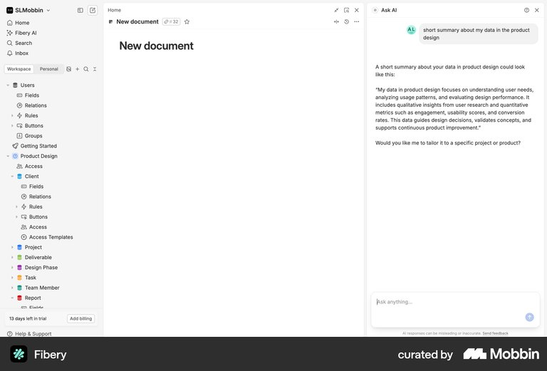
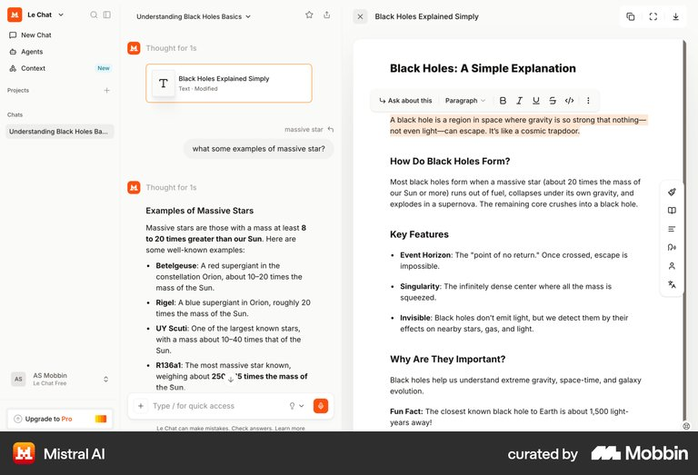

# Persistent conversation: floating chat and a genuine third column

10 September 2026. Research and design proposals; no conversational UI or model integration implemented.

**Next stage:** the [conversation storyboards](../design/conversation-storyboards-2026-09-10.md) compare these two layouts through the same three exchanges, evidence inspection, unsent draft, and close/resume sequence. They include desktop concepts and one shared mobile adaptation.

## Revised brief

Jordan should be able to continue talking to the assistant after receiving Marcus's assessment. The first coaching answer is the beginning of a conversation, not the end of a report. Explore two primary arrangements: a floating chat window over the usable workspace, and a genuine third column beside navigation and main content.

This user direction supersedes the earlier design proposals' restrictions against a second-turn composer, nonmodal desktop interaction, persistent conversation, and host reflow. Those were our design decisions, not requirements in the [assignment README](../../design-engineer-take-home-v3/README.md). The previous all-modal recommendation is no longer the active direction.

## What the fresh research supports

We performed seven focused Mobbin searches and inspected 20 unique web images across the team, including sampled flow states. Separate research examined primary documentation from Notion, Shopify, Slack, and Intercom. This is a pattern study, not a user study or a claim that one layout has measured superior usability. Current public documentation establishes supported behaviour; Mobbin screenshots establish visible states. Neither proves our implementation's accessibility or responsiveness.

### Two placements of a continuing conversation

[Notion Agent documentation](https://www.notion.com/help/notion-agent) explicitly offers Sidebar mode on the right and Floating mode in a separate window over the screen. It also documents chat history and pinning. This directly supports treating the user's two proposals as legitimate conversational patterns. It does not, by itself, prove whether Notion's underlying page reflows.

[Shopify Sidekick documentation](https://help.shopify.com/en/manual/ai-powered-tools/sidekick/set-up) describes clarification followed by continued work, page context, compact/fullscreen presentation, and closing the assistant. [Shopify's fullscreen announcement](https://changelog.shopify.com/posts/sidekick-fullscreen-mode) explains the value of extra room for extended conversations. Its phone/tablet support uses the Shopify app; the current help page says Sidekick is unavailable in a mobile browser. Do not cite it as proof of responsive web behaviour.

[Slack's agent documentation](https://slack.com/help/articles/33076000248851-Work-with-AI-agents-in-Slack) describes main-view and split-view conversations, including working alongside an agent. [Slackbot documentation](https://slack.com/help/articles/202026038-How-to-work-with-Slackbot) describes follow-up questions and resuming earlier discussions. These support continuity as a product behaviour, not a requirement to build a full history-management system in this assignment.

### A real three-column reference

[Fibery's document and Ask AI screen](https://mobbin.com/screens/e1f475cd-9340-4b6d-98c3-9ad852993175) shows navigation on the left, a document in the centre, and a right AI column with a question, answer, invitation to continue, composer, and close control.

In the sampled [Fibery flow](https://mobbin.com/flows/36e03ba2-42f4-4d55-95c9-fb37f906d0db), the initial document occupies the space beside navigation; a later state gives it a narrower centre area next to Ask AI. Previews 1, 3, and 5 were inspected. That is stronger visual support for reallocated workspace than a lone still, while remaining an inference about layout rather than proof of CSS or animation.

### Conversation must use explicit context

[Mistral's document conversation](https://mobbin.com/screens/76e16697-0e20-4bfc-8162-e93d6f1fc8ff) shows an earlier document item, a follow-up about selected text, an answer, and the retained document. Its order is navigation, conversation, document; it is not the exact requested column order. It is useful evidence of why keeping work and dialogue together matters.

[Dropbox Dash](https://mobbin.com/screens/47b713f0-ddcf-42a6-a7ec-e1ddfd45eb04) shows repeated prompts and replies, a composer, and an adjacent document. The assistant nevertheless asks the user to supply text. The lesson is specific: visible adjacency alone does not establish that the assistant understands the material beside it. Aria should state the conversation's actual scope: Marcus's supplied coaching assessment, not unseen transcripts or all workspace data.

### Floating messaging precedent and limitations

[Pinterest messaging](https://mobbin.com/screens/62432d61-7c59-4525-a0ac-2a0ce0ebf2ca) shows a narrow conversation surface beside an otherwise visible feed, with messages and a persistent composer. It is a human-messaging reference, not an AI coaching interface or a bottom-right implementation.

[Intercom's Messenger documentation](https://www.intercom.com/help/en/articles/6612589-set-up-and-customize-the-messenger) describes a corner launcher, ongoing conversations, and opening directly into a conversation. Its [FAQ](https://www.intercom.com/help/en/articles/6612597-messenger-faqs) explicitly says its website chat is not fullscreen and the conversation window size is not configurable. Our custom design can make different choices; do not claim those features belong to Intercom.

Mobbin did not return exact Facebook or Instagram web chat screens in the focused social-chat query. Those remain the user's interaction analogy. [Origin](https://mobbin.com/screens/24fea78e-bea4-493b-99f3-fe9a34681d9a) returned a large modal pending answer, [Dribbble](https://mobbin.com/screens/10893961-cb64-4a9d-9c8f-833a30928535) a video-chat panel, [Telegram](https://mobbin.com/screens/77cde984-a8a3-4cf3-96a5-8566cdedd6b1) an AI text editor, and [Vercel](https://mobbin.com/screens/c3902a37-28af-44dd-a7c3-e3033a22c79d) a feedback form; none was treated as proof of the requested persistent floating AI chat.

## A. Persistent floating chat

**Purpose:** ask, inspect, and continue while leaving the main page's layout in place.

- The existing bottom-centre entry submits Jordan's first message and opens a floating conversation, initially exploring a bottom-right position.
- Use a wider reading area than a small social-message bubble. Approximately 440–480 px wide and a viewport-capped height is a starting hypothesis; verify the actual card and long evidence text.
- Keep a compact header, one scrolling transcript, and a composer below it. The initial question becomes a user message; the supplied stream becomes the first assistant message, with the coaching card embedded beneath its narrative.
- Keep the desktop workspace usable: no blocking scrim, inert host, or modal focus trap. Clicking the workspace should not dismiss or erase the chat.
- Close hides the window and retains the thread, draft, and reading position for the current app session. Reopening resumes them. A separate minimize control is optional; it must not ambiguously duplicate close.
- Use one active composer. While the chat is open, the existing entry can focus/resume the conversation instead of acting as a second unrelated input. Closing restores the original entry and its focus pathway.
- On mobile, use a full-width/full-height conversation view with a reachable composer and explicit close; handle the software keyboard and changing viewport.

**Strength:** smallest change to the supplied shell; familiar continuing-message model.

**Risk:** covers some workspace content and gives less room to long threads. A later expand/dock control could address this, but should preserve the conversation and draft.

## B. Integrated conversational column

**Purpose:** provide a durable place for the assistant alongside the workspace, supporting repeated inspection and follow-up.

- Opening adds a real third grid column: navigation → main content → conversation. The main area's allocated width decreases; the chat does not cover it.
- Keep all three areas usable on sufficiently wide desktops. The conversation has its own header, transcript scrolling, and composer. This requires nonmodal desktop behaviour.
- Keep the original assessment in its assistant message; later turns append below it. Do not replace the card every time a follow-up arrives.
- Adapt the middle area's layout to its available width: the greeting/date can wrap, and the three statistics cards can move to fewer columns. This is scoped integration, not a host redesign.
- Closing restores the main area's width but retains the conversation. Reopening restores the same thread and draft rather than replaying the mock.
- At intermediate widths, the existing compact navigation is a possible adaptation. At narrow widths, switch to a full-width conversation view instead of forcing three unusable columns.

**Width feasibility, calculated from current CSS:** the full sidebar is 240 px, compact sidebar 72 px, and main horizontal padding is `clamp(20px, 4vw, 56px)`. With an illustrative 420 px conversation column:

| Viewport | Main column before padding | Main content after current padding |
|---:|---:|---:|
| 1440 px | 780 px | 668 px |
| 1280 px | 620 px | About 518 px |
| 1024 px | 364 px | About 282 px |

These are calculations, not rendered validation. The current shell changes layout at 760 px based on viewport width, which is insufficient by itself when a chat column reduces the main container. Choose the new breakpoint after checking real content. Avoid silently overriding a user's navigation preference; if automatic compacting is used, define and test restoration on close.

**Strength:** best fit for a workspace assistant that is part of the product's ongoing workflow.

**Risk:** requires careful container-aware reflow and deliberate smaller-screen behaviour. The assistant's visible location does not grant it access to host data.

## A further direction: one conversation, two placements

Floating and docked can be modes of the same assistant rather than separate implementations. A Dock / Float control could retain messages, draft, evidence state, and scroll position while changing containment. Notion provides direct precedent for these placements.

This is a credible extension once one default is coherent. The conversation model should support it cleanly, but a mode switch should not displace the first-answer quality or become a second window-management project. No drag-to-dock mechanism is needed to communicate the idea.

## The conversation to design in both approaches

The following is a **proposed storyboard**, not a transcript produced by the starter or a claim that a model is connected:

1. Jordan submits the supplied discovery-call question from the existing entry.
2. The AI emits the required status, three text chunks, and complete card. Jordan can inspect skill evidence. A follow-up composer remains available.
3. Jordan asks, “What supports the stakeholder-discovery concern?” The assistant explains the supplied evidence: three calls ended without confirming who else shapes the decision. It does not invent which calls or people were involved.
4. Jordan asks, “Help me phrase the question for the next Brookfield call.” The assistant can offer a clearly identified draft based on the supplied next step. For example: “Who else needs to validate the operational and legal readiness of this project?” This is suggested wording, not a historical quote from a call.
5. Jordan closes the assistant to inspect the host, then resumes the same conversation and unsent draft.
6. If asked for last quarter's comparison or the recordings, the assistant explains that those records are not available in its supplied context. It does not manufacture data.

Free text is central. Suggested follow-ups may help people start, but should supplement the composer rather than substitute for a conversation. Keep the scope visible with a concise context label, such as “Marcus's coaching assessment,” without implying that all six transcripts are available.

For longer threads, a small route back to the original assessment may help inspection; test the need before adding a separate pinned-card panel or extra navigation.

## What the README and starter mean for conversation

The README requires one polished initial answer and a meaningful card interaction. It neither mandates chat history nor bans additional turns. Small integration changes and an optional enhancement are allowed. The user's preferred conversational experience is now an intentional extension of the supplied first-answer exercise.

The [mock](../../design-engineer-take-home-v3/mock/streamAnswer.ts) ignores `_prompt`; calling it for every follow-up would replay the same answer. The starter has no follow-up dataset, model endpoint, or conversation store. Closing unmounts the assistant, so persistent state must live outside the dismissible surface.

Two honest ways to make the proposed conversation work:

- **General typed follow-ups:** keep the required first stream unchanged, then use a real model for subsequent turns, grounded in the supplied assessment and the conversation so far. Keep model credentials on a server. Missing transcripts remain missing even with a model. This adds real request, cancellation, and network-error work; none of those were hidden requirements of the mock.
- **Bounded prototype demonstration:** use explicitly identified authored follow-up scenarios with an honest response for unsupported input. It is useful for reliable review but is not equivalent to general free-form AI. Do not silently substitute this if the expected result is a real conversation.

For the user's stated expectation that typed follow-ups work generally, the first approach is the better functional match. No provider, deployment, credential, or implementation decision is made by this research.

## Shared interaction requirements to carry forward

- Preserve the first answer's exact wording, scores, period, evidence, and next step. No `/5`, numerical thresholds, fabricated source links, or new performance facts.
- Keep the card's evidence interaction even when the composer is added; conversational UI does not replace that README requirement.
- Desktop allows keyboard movement between the assistant and host, with visible focus and a clear way back to the composer. Do not apply modal semantics while leaving the host usable.
- Escape dismisses the assistant and returns focus to the supplied entry, while respecting a nearer active popup that already handles Escape. Mobile may use modal/full-screen semantics when it occupies the screen.
- Incoming answers must not steal focus from the composer or from the host. Announce meaningful per-response progress/completion rather than every text chunk. Suppress background announcements when the conversation is hidden.
- Follow arriving content only while the reader is already at the bottom. If they scroll upward to inspect earlier evidence, preserve that position and provide a clear indication of a new reply.
- Keep the draft while another response is streaming; define one active send at a time, prevent duplicate submissions, and preserve normal multiline and text-composition input.
- Specify close-during-generation: hiding may allow the active response to finish in session, with no forced reopening. A real model's cancellation path must not silently erase the thread or pretend an incomplete answer is complete.
- In the third-column mode, opening/closing reflow is intentional once; subsequent token arrival must not change column width. Reduced motion changes layout immediately without spatial animation. In floating mode, use a restrained entrance and static alternative.
- Test desktop, narrow mobile, keyboard, screen reader, reduced motion, evidence expansion, close/resume, scroll retention, and `speed: 0`. None has been established by this research.

## Recommendation

Explore the **integrated conversational column** as the primary workspace direction and **persistent floating chat** as the lighter alternative. Both should be judged with the same initial answer and at least two genuine follow-up turns, plus close/resume—not just a completed coaching-card screenshot.

The earlier focused modal is no longer the default recommendation under this revised brief. A dock/float switch is a possible evolution of the chosen conversation model, not a requirement to ship every mode now.

## Search ledger and evidence limits

Mobbin queries used one shared generic intent: “Research persistent conversational AI layouts that let users ask follow-up questions while retaining workspace context.” No private assignment source text was sent as a search query.

| Search | Query summary | Observed images |
|---|---|---|
| Floating social chat | Facebook Messenger floating conversation | [Dribbble](https://mobbin.com/screens/10893961-cb64-4a9d-9c8f-833a30928535), [Origin](https://mobbin.com/screens/24fea78e-bea4-493b-99f3-fe9a34681d9a), [Pinterest](https://mobbin.com/screens/62432d61-7c59-4525-a0ac-2a0ce0ebf2ca); 3 images. Exact named product did not return. |
| Floating AI chat | Floating AI conversation with replies and follow-up input | [Origin](https://mobbin.com/screens/24fea78e-bea4-493b-99f3-fe9a34681d9a), [PayPal](https://mobbin.com/screens/1bb7d55f-bddd-4a37-a6a4-17a8d961cd37), [Telegram](https://mobbin.com/screens/77cde984-a8a3-4cf3-96a5-8566cdedd6b1); 3 images, Origin duplicate. |
| Chat widget | Customer-support conversation over a dashboard | [Customer.io](https://mobbin.com/screens/17e9e91c-92cd-4a08-b322-1c60b9a40f3b), [Dropbox Dash](https://mobbin.com/screens/92205103-29c6-43ab-a46c-6a4e13fd208a), [Vercel](https://mobbin.com/screens/c3902a37-28af-44dd-a7c3-e3033a22c79d); 3 images. None was a close floating-chat match. |
| Notion flow | Chatting with AI and follow-up questions | [12-screen flow metadata](https://mobbin.com/flows/10f0c9b9-6042-49f6-8f59-39439d8e0bcc); 4 emitted previews inspected. Completed answer/composer visible, but not proof of repeated follow-up turns. |
| Third-column screen | Navigation + document + right assistant conversation | [Dropbox Dash](https://mobbin.com/screens/47b713f0-ddcf-42a6-a7ec-e1ddfd45eb04), [Fibery](https://mobbin.com/screens/e1f475cd-9340-4b6d-98c3-9ad852993175), [Langdock](https://mobbin.com/screens/579fb137-50fa-42d0-9222-4970f35648d5); 3 images. |
| Fibery flow | Ask AI beside a document and continue | [5-screen flow metadata](https://mobbin.com/flows/36e03ba2-42f4-4d55-95c9-fb37f906d0db); previews 1, 3, 5 inspected; final Fibery screen duplicate. |
| Persistent workspace chat | Document + navigation + multi-turn AI conversation | [Strut](https://mobbin.com/screens/b62c8642-7dab-41c1-b03f-826c38c567a3), [Semrush](https://mobbin.com/screens/34501fa3-8ec1-4fd4-84e1-aa0d7866389f), [Mistral](https://mobbin.com/screens/76e16697-0e20-4bfc-8162-e93d6f1fc8ff); 3 images. |

Total: 22 image occurrences, 20 unique images. The observations of multi-turn history, composer presence, and placement are separated above from proposed persistence, focus, motion, and shared-context behaviour. There was no new mobile Mobbin query in this pass and no live reference-product usability testing.

The two saved JPEGs are unmodified native Mobbin MCP images retained as private research references, not application assets. Independent brief/feasibility and visual-source reviews found no material issues in this revised research document.
